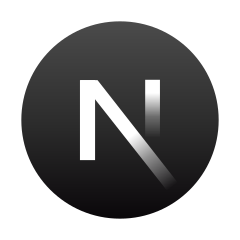

<h1 align="center">Hi 👋, I'm Miguel Enrique Dasalla</h1>

###

<h3 align="center">A passionate frontend developer and aspiring backend developer.</h3>

###

- 👨‍💻 All of my projects are available at [https://khadalicioso.github.io/miguelenriquedasalla/](https://khadalicioso.github.io/miguelenriquedasalla/)

###

# 💻 Skills and Technologies

  
  
  
  
  
  
  
  
  
  
  
  
  
  
  
  
  
  
  
  
  
  
  
  
  
  
  
  
  
  
  
  
  
  
  
  
  
  
  
  
  
  
  
  
  
  

###

# 📊 GitHub Stats:

  
 
 

###

### 🔝 Top Contributed Repo

